# Forage Boutique

## About Forage Boutique
Forage Boutique is a web application targeted at Amsterdam-based individuals who are interested in purchasing plants. As a full-stack e-commerce web application this project was built using Django, Python, HTML, CSS and JavaScript. This is a B2C (Business to Customer) designed to create better user experience to clients and provide useful management tools for the business owner. 

[Forage Boutique live website!](https://forageboutique.herokuapp.com/)

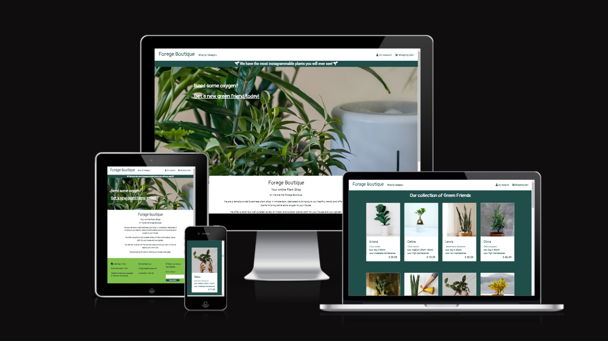

## UX/UI
Using core Design Thinking methods and Agile practices principles the strategy for this web application takes into consideration 2 personas: Business Owner and Client, and their respective needs. 

### User Stories

All user stories are documented with their respective acceptance criteria, story points and MoSCoW prioritization on [my Github Issues](https://github.com/anabramos/forageboutique/issues) or on [this excell google sheet](https://docs.google.com/spreadsheets/d/1tIHWxuTbgwAMaqZkwu3j8kelPhfHuCNg/edit?usp=sharing&ouid=116746214337321598702&rtpof=true&sd=true)

##### Future Features
The User stories that were tagged 'Could Have' & 'Wont Have' were left Open on [my Github Issues](https://github.com/anabramos/forageboutique/issues) to represent future features that I wish to build for this application in the future.  

### Agile Practices

#### Wireframes
- All wireframes were designed with Canva tool. These can be found [here](https://github.com/anabramos/forageboutique/tree/main/media/wireframes). Final web application will differ slightly from wireframes as it will utilize more similar structures between different pages for better visual appeal and user experience.

#### Product Backlog & Project Board
- I created my product backlog using [my Github labels](https://github.com/anabramos/forageboutique/issues) with different colors, dividing user stories clusters more or less equally per iteration/epic. This however did not translate the build up order of the project, as I had overestimated how some tasks and features are dependent from others to being build.  
- For information radiators I have made use of [my Github Projects](https://github.com/anabramos/forageboutique/projects/1)

### Scope & Structure

In response to the user stories attributed to business owner and clients, the website and its features are structured withing the following 5 Custom Django apps:

1. Home
    Concerns the design of a Front-End web application that meets accessibility guidelines and provides a set for responsive user interaction via its homepage, navbar and navigation links. It contains a homepage with information about the website and navigation links that will take the client to different website features. 
2. Products
    Concerns the display of all products provided by the business owner, including prices. These are directly linked to the database and can be updated at anytime by admin users. Changes on the database are also immediately  translated to the Front-End of the website.
3. Bag
    Concerns the ability of clients to add and manage their bag contents and wished purchases, including modifying and deleting items from their shopping carts. 
4. Checkout
    Concerns the ability of clients to make and manage their purchases using financial software Stripe. This app also includes the possibility of retreiving information about past orders. This feature is only available for registered users when logged-in. Un-registered users will be requested to create an account if they want to access their purchase history.
5. Accounts
    Concerns the ability of clients to create and manage their account, including modifying the account details and shipping address. This feature is only available for registered users when logged-in. Un-registered users will be requested to create an account if they want to have their details saved for future purchases.

This web application also utilizes built-in django applications, frameworks and libraries to compliment the above mentioned structure and features. 

#### Database Structure

I have connected the database to the Heroku Postgres database from the beginning of deployment. I have created original custom models, the Entity-Relationship Diagram [here](https://github.com/anabramos/forageboutique/blob/main/media/database/database.PNG) shows how the database models relate to each other. 

### Design

#### Colors
The website colors are inspired by tons of green and terracota as key plant store colors. It uses dark green color and white to create contrast between text and background, and the other colors are used intertwined to reinforce borders, banners and highlight certain features/sections in the website.

#### Fonts
The website uses a combination of Pangolin and Roboto Condensed, with a fall back to sans-serif. These fonts are popularly paired together. Pangolin is used in the website for high-level headings and logo while Roboto Condensed is used for regular text and low level headings. The fonts were compared and taken from Google Fonts.

#### Icons
This website makes use of icons from Font Awesome to give a new visual element and reinforce the content already displayed. The Icons are used to indicate social media links on the website's footer.

## Features

### Homepage
- The navbar is a big menu for what the website has to offer. It contains links to other active pages within the website, providing a easy and intuitive navigation. 

    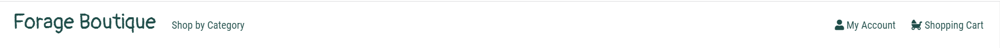

- The About section brings to the audience information about the businesses to create a more personal approach.

    

- The footer provides to the user details about the business, a newsletter signup input, links to the relevant social media of the business owner, as well as the copyright information of the web developer.

    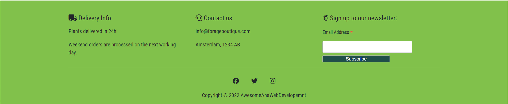

### Products
- The products section displays all products sold by Forage Boutique, with images, name and prices. These are linked to the web applications' database. Clicking on the image will take the customer to the product details page, where more information about the products are displayed. 

    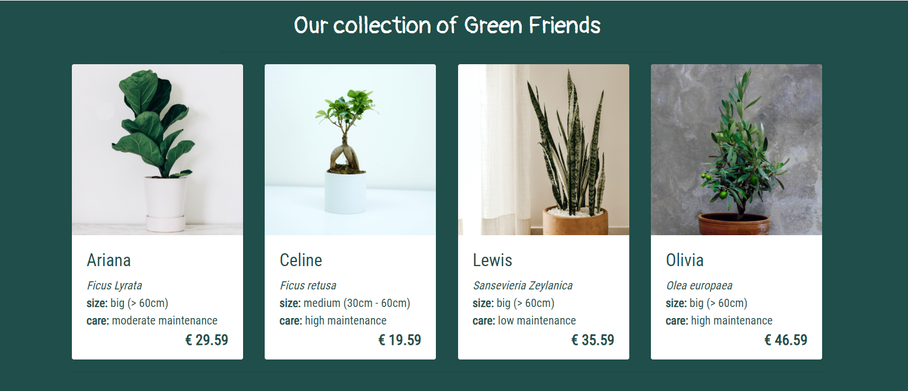
    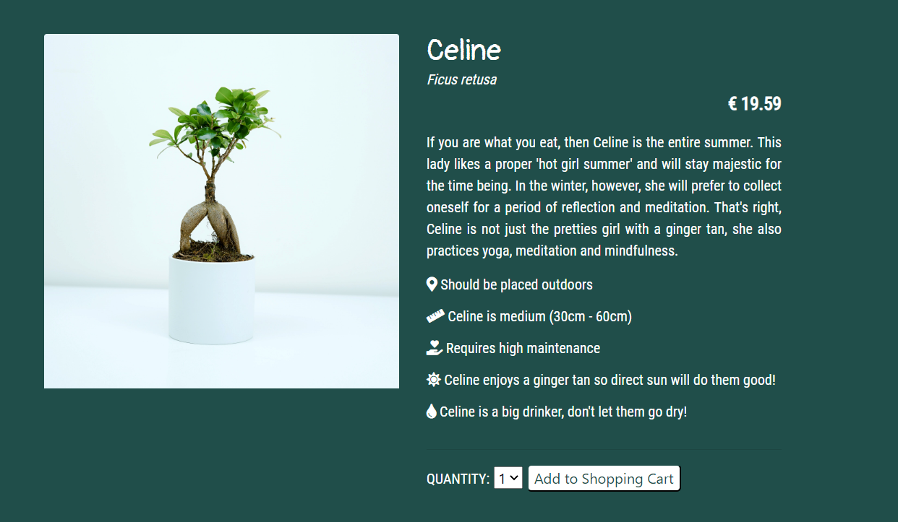

### Shopping Cart
- In the shopping cart feature, users can review and update the contents of their shopping cart before going to the checkout page, or decide to continue shopping. 

    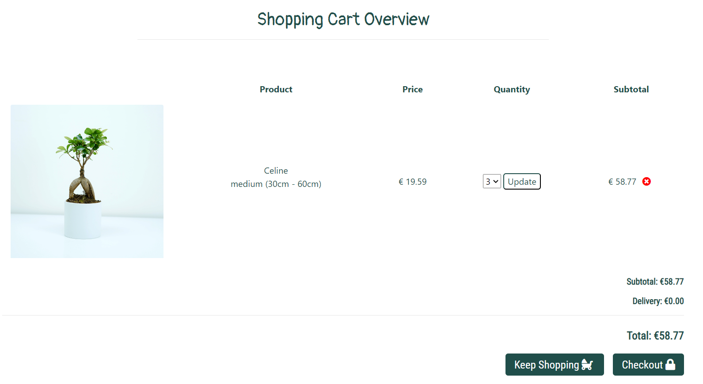

### Checkout
- The checkout feature allows users to confirm and make payments of they purchase. The checkout form can only be submitted if the information is valid and the same applies to the stripe payment details.

    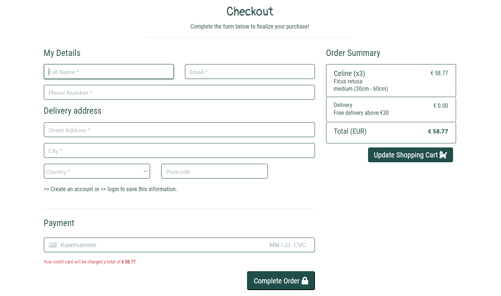

### Checkout Successfully
- The checkout successfull page will present to the user their order details and confirmation of payment. If the user is a registered user, these will also be saved under their user accounts. 

    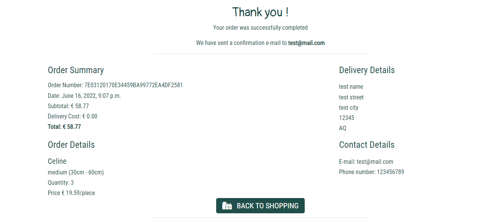

### User Account
- In the 'my account' section users are able to check their user details and their orders. They can also modify their user details and shippoing information, as well as look back into orders fully. 

    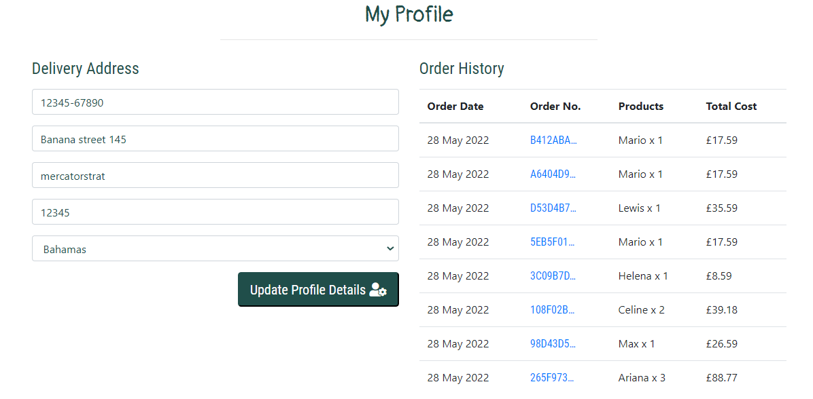

### Admin Account
- When an admin is logged in, they have access to the admin account with product managment tools and forms that perform CRUD functionality. This means admins can add, edit and remove any products or information related to products.

    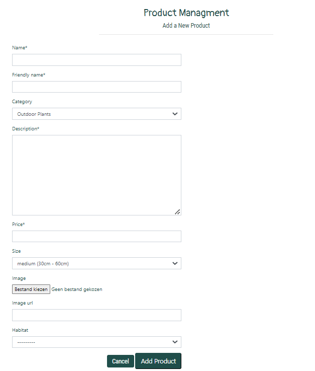
    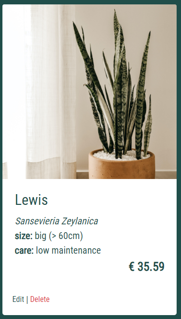

## Testing

This web application was tested manually by self, web developer friends, a few code-institute peers and family members. It was tested on different screen sizes and browsers. Below I have gathered the feedback from these manual testings and conclusions. 

### Implemented & Tested User Stories

#### USER STORY: Good UX/UI practices (1) - As a Customer I can navigate the website intuitively so that I can find the information I need.
- The website is pleasing to look and navigate, it uses good color contrast and common language and standards related to e-commerce websites. 

#### USER STORY: Good UX/UI practices (2) - As a Customer I can access all existing and relevant landing pages/features from the website's homepage so that I can easily navigate and understand what the website is offering.
- The Navbar takes the user to the majority of different pages throughout the website. There are no webpages that exist that cannot be found through starting the navigation in the homepage. No webpage is within less than 3 webpages from the navbar. 

#### USER STORY: Navigation Bar - As a Customer I can find a website navigation bar with my shopping basket so that I can check what I have added to the basket and how much that costs.
- The Navbar takes the user to all different pages throughout the website. It is responsive to different screen sizes, styled with collapse menu for mobile versions. 

#### USER STORY: Footer - As a Customer I can find a website footer with practical details about the company so that I can get in touch with the company if I need to, or access their social media.
- The Footer informs the user about the contact details of the company, and it provides with two different web marketing tools: Access to social media links and newsletter registration. 

#### USER STORY: Responsive web application - As a Customer I can access the website on my mobile as well as my desktop so that I can use the website regardless of where I am.
- The application has ben tested in different mobile screen sizes, using not only the telefone and computer of friends and family but also Chrome Dev tools and other online responsive testing softwares. 

#### USER STORY: Messages - As a Customer I can get notifications from the website every time the status of my profile/shopping basket changes, or if there is an error so that I know what has happened and if I need to act upon it.
- Boostrap toats are used to display messaged. The application is displaying messages that confirm user status related to registration and log-in/log-out. It also displays messages when products are added to the shopping bag and when they are purchased successfully. Lastly, they also pop up when any changes to the database are made in the front-end either by user changing their user details, or by admin adding/editing products.

#### USER STORY: List of Products - As a Customer I can access a list of available products from the home page so that I can see if the product I want is available before making an account.
- All products, their image and prices are available to the user in a page where all products are displayed. That is open to all website visitors regardless of registration. These are rendered directly from the database which means they are always up to date. The products page can be easily found in the navbar of the website.

#### USER STORY: Details Products - As a Customer I can access all of the relevant information about the products (prices, description, sizes, etc.) so that I can make informed decisions before purchasing.
- For all products, further details about the plants like description, caring details, etc. are available to the user in a separate page per product.

#### USER STORY: Product Categories - As a Customer I can filter the products by categories so that I can find products that suit my preferences faster.
- Products are separated between indoors and outdoor plants. When selecting a category, only plants from that category will be displayed. No plants are displayed on both categories.

#### USER STORY: Add to Bag Functionality - As a Customer I can add products I want to purchase to my basket so that I can purchase it later.
- In the product details page customers can add product(s) to their cart by clicking on the 'add to shopping cart' button. They will receive a confirmation message that this was sucessfully done. If they redirect to the shopping cart overview page they will see the item there.

#### USER STORY: Bag overview - As a Customer I can view the overview of my basket before proceeding to checkout/purchase so that I can make any last minute changes.
- Bag overview will show all items a customer had added to the shopping cart. Unless, if there are no items there, the page displays a message confirming that there are no products in the shopping cart and direct users to the products page to start shopping again.

#### USER STORY: Stripe payment - As a Customer I can make a payment with a credit card so that I can purchase my selected products.
- Stripe payment is well implemented and is creating successfull orders in the database, rreturning confirmation messages and a confirmaton checkout page, as well as returning successfull payments on the events tab in the stripe dashboard. 

#### USER STORY: Confirmation e-mail - As a Customer I can receive e-mail confirmations with my order details so that I know that my purchase has been processed successfully.
- E-mails are being printed to the CL locally everytime a purchase is made. Customers can access their order details on their accounts and retreive any information about their past orders. 

#### USER STORY: User registration - As a Customer I can register & login on the website so that I can view my account details and orders on a 'my account' page.
- Django allauth account system is implemented to allow users to register, login and logout. This open up the possibility of users to accessing the 'my account' page, to save their details for future purchases and retreive old orders. The registration requires users’ username, email, first and last name and a set of passwords. After registration the users’ details are saved in the database and they will then be able to login with only e-mail/username and password.

#### USER STORY: Logged-in/out confirmation token - As a Customer I can easily see when I am logged in or logged out so that I know if I need to act upon that based on what I would like to do in the website.
- The Navbar is responsive to the users status within the website, as it changes based on if users are logged in or not. For users who are not registered nor logged in, it allows them to easily find the ways to create and account or see the products available. For logged in users, they will see a link to their 'my account' page (see feature bellow) or directing them to logout.

#### USER STORY: User update details - As a Customer I can update my account details and shipping address so that they are saved for future purchases, saving me time.
- Users can edit their details, specifically their shipping address for future purchases, in their own user accounts. All changes done and saved by the admin are immediately translated to the front-end and backend of the website.

#### USER STORY: Admin backend view - As a Business Owner I can log in with an admin's account so that I can access the website's backend.
- Django Admin site well implemented. It uses username and password for validation. Only the superuser/admin has access to the backend. Regular users will not be able to log in to the admin page with their credentials.

#### USER STORY: CRUD Functionality - As a Business Owner I can create, remove, update or delete products displayed on the website's front end so that the website always translates the products available at different moments.
- Admin/superusers can add, edit and delete products, their details, images, descriptions, prices, etc. All changes done and saved by the admin are immediately translated to the front-end and backend of the website.

#### USER STORY: Change Product Prices - As a Business Owner I can update the price of products from the website's front end so that I can keep the website up to date to accurately reflect the market prices.
- Change of prices per products is possible through the CRUD functionality implemented and tested as described above.

#### USER STORY: Newsletter - As a Customer I can Sign up for a newsletter so that I can receive information on new products and good deals.
- Customers can sign up for a newsletter. After submitting their e-mail to sign-up, a message is displayed on the website. The e-mail of the newsletter subscriber is also available on the mailchimp account dashboard.

#### USER STORY: Social Media Business Page - As a Business Owner I have a social media business page so that I can reach new clients.
- Customers can access the Facebook Business page of Forage Boutique by clicking on the respective social media link on the footer of the website. This is also available [here](https://www.facebook.com/Forage-Boutique-101575012604335)

## Technologies Used

- Languages
    - [HTML5](https://en.wikipedia.org/wiki/HTML)
    - [CSS](https://en.wikipedia.org/wiki/CSS)
    - [Javascript](https://en.wikipedia.org/wiki/JavaScript)
    - [Python](https://en.wikipedia.org/wiki/Python_(programming_language))

- Libraries & Frameworks
    - [Django](https://www.djangoproject.com/)
    - [Bootstrap](https://getbootstrap.com/)
    - [Google Fonts](https://fonts.google.com/)
    - [Font Awesome](https://fontawesome.com/)
    - Many more python libraries, extensions and frameworks can be found under the requirements.txt file

- Tools
    - [Gitpod](https://www.gitpod.io/)
    - [Github](https://github.com/)
    - [Google Chrome Developer Tools](https://developer.chrome.com/docs/devtools/)
    - [Heroku](https://dashboard.heroku.com/apps)
    - [Cloudinary](https://cloudinary.com/)
    - [SQLite](https://www.sqlite.org/index.html)
    - [PostgreSQL](https://www.postgresql.org/)
    - [MBalsamiq](https://balsamiq.com/)
    - [Coolors (color schemes generator)](https://coolors.co/)
    - [Unsplash](https://unsplash.com/)
    - [Am I Responsive?](http://ami.responsivedesign.is/)
    - [WebAIM](https://webaim.org/resources/contrastchecker/)
    - [W3C HTML Validation Service](https://validator.w3.org/)
    - [W3C CSS Validation Service](https://validator.w3.org/)
    - [Pep8](http://pep8online.com/)
    - [JSHint](https://jshint.com/)
    - [Stripe](https://en.wikipedia.org/wiki/Stripe_(company))

## Deployment

The website was deployed using Heroku. My repository is build using the Code Institute Python Essentials Template. The deployment was done on the second day of building this repository. To deploy this website I used Code Institute's Django Deployment Instructions provided in the course section I Think Therefore I Blog > Getting Set Up > Creating The Django Project Checklist. 

For deployment, the following steps were taken:
- On myGitpod workspace - Command Line:
1. Install Django - `pip3 install Django==3.2 gunicorn`
2. Install Django supporting libraries: Psycopg2 and Cloudinary `pip3 install dj_database_url psycopg2` | `pip3 install dj3-cloudinary-storage`
3. Update requirements.txt file `pip3 freeze --local > requirements.txt`
4. Create Django Project and relevant apps `django-admin startproject PROJ_NAME .` | `python3 manage.py startapp APP_NAME` 
5. Add installed apps to settings.py file
6. Migrate Chnages `python3 manage.py migrate`
7. Run server for testing `python3 manage.py runserve`
- On Heroku:
8. Create new Heroku app
9. Add Heroku Postgres Add-ons from Heroku's resource tab
10. Copy DATABASE_URL value to Heroku's Config Vars under settings tab
- On my gitpod workspace - Directory:
11. Create env.py file
12. Import os library
13. Set up DATABASE_URL and SECRET_KEY environment variables
- On Heroku:
14. Set SECRET_KEY value to Heroku's Config Vars under settings tab
- On my Gitpod workspace - Settings.py file:
15. Import os library and set up database to function on local environemt
16. Add replacement SECRET_KEY value
17. Comment out DATABASE = { } section
18. Add new DATABASE section that links with Heroku's config var 
- On my Gitpod workspace - Command Line:
19. Save all files and make migrations `python3 manage.py migrate`
- On my Cloudinary account:
20. Copy my CLOUDINARY_URL from Dashboard
- On my Gitpod workspace - env.py file:
21. Add Cloudinary URL to env.py file
- On Heroku:
22. Add Cloudinary URL to Heroku Config Vars
23. Add DISABLE_COLLECTSTATIC to Heroku Config Vars 
- On my Gitpod workspace - Settings.py file:
24. Add Cloudinary Libraries to installed apps
25. Tell Django to use Cloudinary to store media and static files by setting up Static Files Storage variables
26. Add Heroku Hostname to ALLOWED_HOSTS
- On my Gitpod workspace - Directory:
27. Create Procfile on the top level directory
28. Add code to Procfile `web: gunicorn PROJ_NAME.wsgi`
- On my Gitpod workspace - Command Line:
29. Perform Git control and push changes to repository
30. Perform Git control and push to Heroku main
- Before submission of project:
31. Disable static files on Heroku Config Var
32. Set DEBUG to False

### Forking
To use this project as a reference or starting point, or even to propose changes to it, you can fork this repository by following these steps:
From the GitHub repository page click on 'Fork' in the top-right corner.
Create a new repository with a new name based on this project.
Make sure to credit the project in case you decide to use any of the original code.

## Credits
Media
- All images for this website were taken from [Unsplash](https://unsplash.com) and can be found on [this list](https://unsplash.com/@anabramos/likes).

## Acknowledgements
A huge thanks to my mentor Samantha Dartnall, the CI slack community and tutoring team, and my friends who tested the website a couple 100 times.